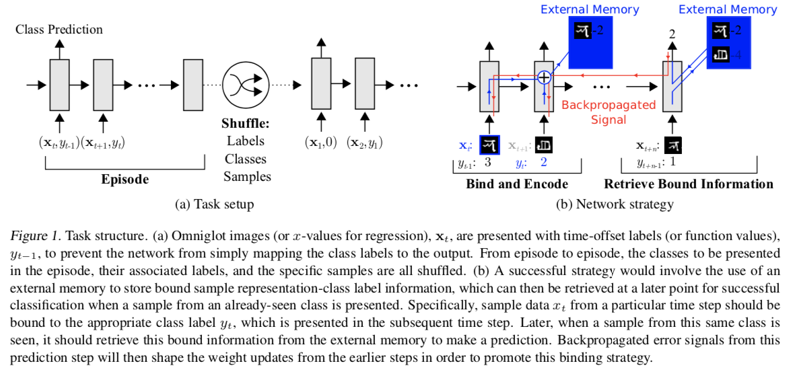
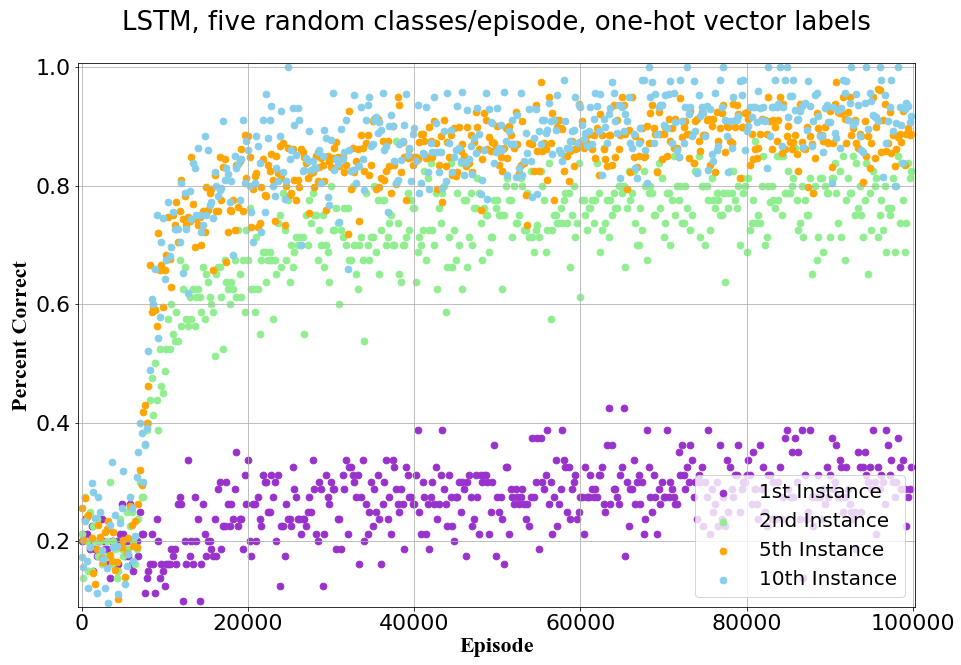
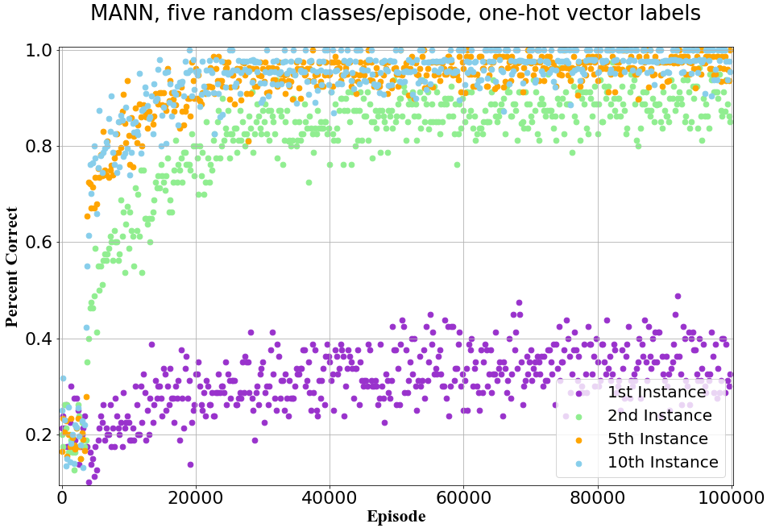

# Meta-Learning with Memory-Augmented Neural Networks in Tensorflow  

A concise alternative Tensorflow Implementation of Papar *Santoro, Adam, et al."[Meta-learning with memory-augmented neural networks.](http://proceedings.mlr.press/v48/santoro16.pdf)"International conference on machine learning. 2016.*
And the model are encapsulated into class MANNCell which can be used as BasicRNNCell.
The code is inspired by the excellent implementations of [tristandeleu](https://github.com/tristandeleu/ntm-one-shot) and [snowkylin](https://github.com/snowkylin/ntm).


## Memory-Augmented Neural Networks   
As shown in reference paper, MANNs(Memory-Augmented Neural Networks) refer to the class of external memory equipped networkds such as NTMs(Neural Turing Machines).
<span><div style="text-align: center;">

</div></span>   

## Dependencies  
* Python 3.6  
* Tensorflow==1.14
* numpy==1.16.4  
* PIL==7.1.1  

## Usage
### Omniglot DataSet  
Download [images_background.zip](https://github.com/brendenlake/omniglot/blob/master/python/images_background.zip) (964 classes) and [images_evaluation.zip](https://github.com/brendenlake/omniglot/blob/master/python/images_evaluation.zip) (679 classes),
and place them in the [./omniglot](omniglot) folder.  

### Running  
`python run_mann.py`  
`python run_mann.py --mode test`  
`python run_mann.py --model LSTM`  
`python run_mann.py --model LSTM --mode test`

### Class MANNCell()
```python  
from mann.mann_cell import MANNCell
cell = MANNCell(
    lstm_size = 200, 
    memory_size = 128,
    memory_dim = 40,
    nb_reads = 4,
    gamma = 0.95
)
state = cell.zero_state(batch_size, tf.float32)  
output, state = tf.scan(lambda init, elem: cell(elem, init[1]), elems=tf.transpose(input, perm=[1, 0, 2]), initializer=(tf.zeros(shape=(batch_size, lstm_size+nb_reads*memory_dim)), state))  
output = tf.transpose(output, perm=[1, 0, 2])
```


## Performance  
Omniglot Classfication:  

 |  
 ---|---


Test-set classfication accuracies on the Omniglot dataset, using one-hot encodings of labels and five classes presented per episode.

| Model | 1<sup>st</sup>  | 2<sup>nd</sup> | 3<sup>rd</sup> | 4<sup>th</sup> | 5<sup>th</sup> | 10<sup>th</sup>|
| :--- | :---: | :---: | :---: | :---: | :---: | :---: |
| LSTM<sub>ref</sub>   | 24.4% | 49.5% | 55.3% | 61.0% | 63.6% | 62.5% |
| LSTM<sub>repo</sub>  | 30.4% | 77.9% | 85.3% | 87.5% | 88.8% | 91.6% |
| MANN<sub>ref</sub>   | 36.4% | 82.8% | 91.0% | 92.6% | 94.9% | 98.1% |
| MANN<sub>repo</sub>  | 35.4% | 89.2% | 95.2% | 96.3% | 96.9% | 97.8% |


